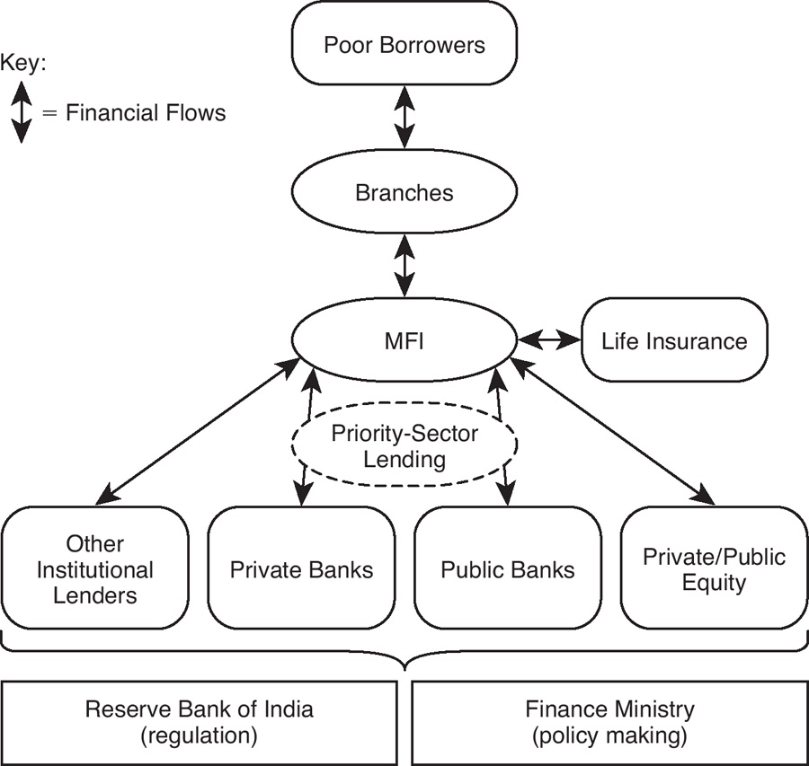
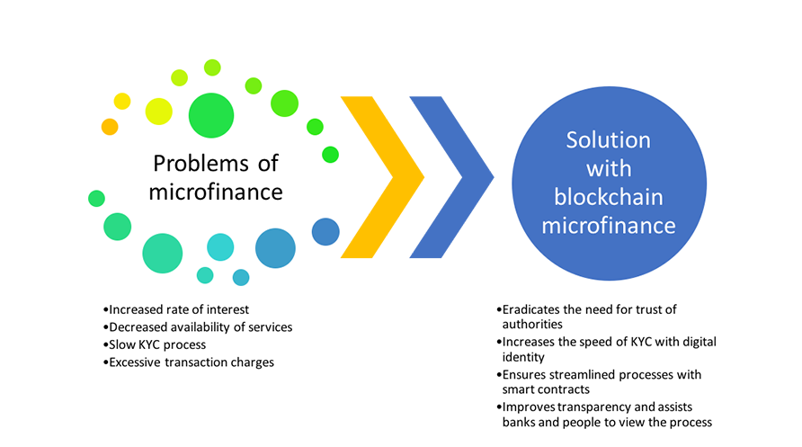

# Microfinance #

**If code is showing an file location error then put the contents of
hpp file into cpp file**

## What is Microfinance ? ##

Microfinance, also called Microcredit​, is a type of banking service that is provided to unemployed or low-income individuals or groups who otherwise would have no other access to financial services ie unbanked or underbanked. While institutions participating in the area of microfinance most often provide lending, many banks offer additional services, such as checking and savings accounts, and micro-insurance products; and some even provide financial and business education. Ultimately, the goal of microfinance is to give impoverished people an opportunity to become self-sufficient.

