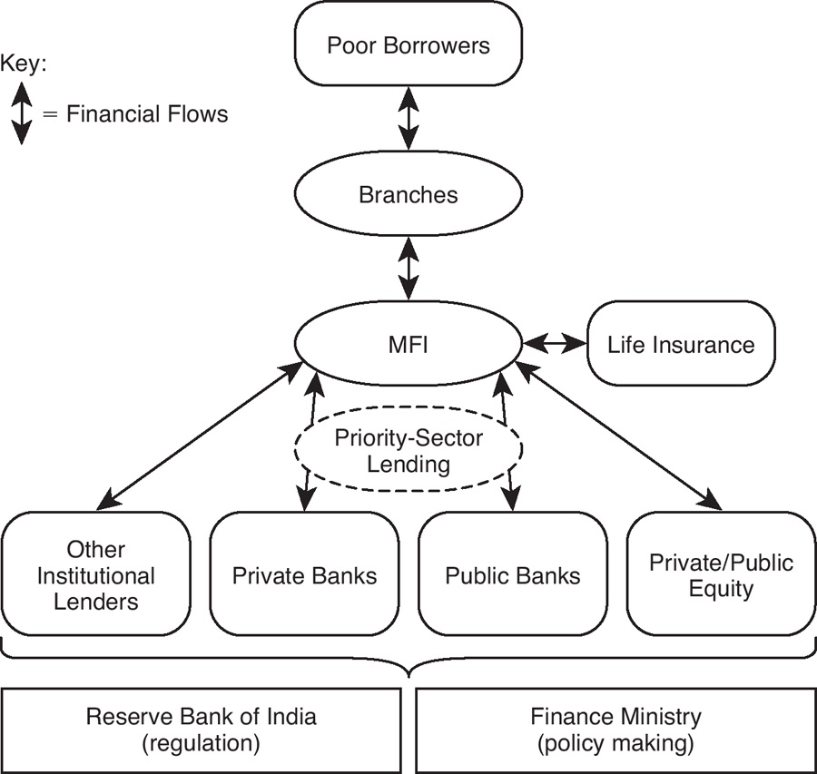
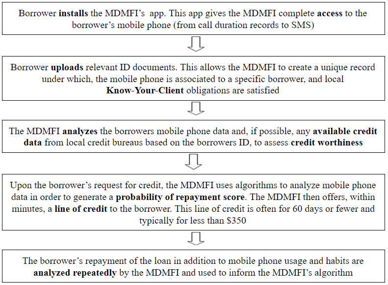
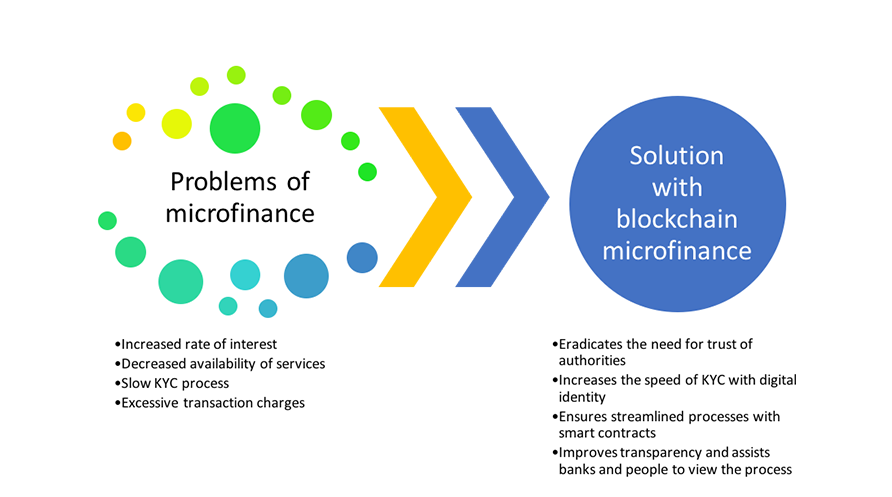
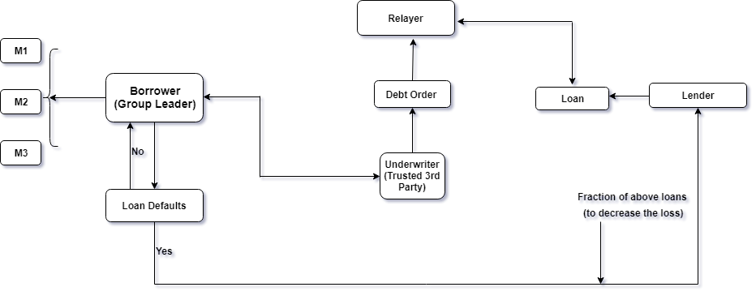
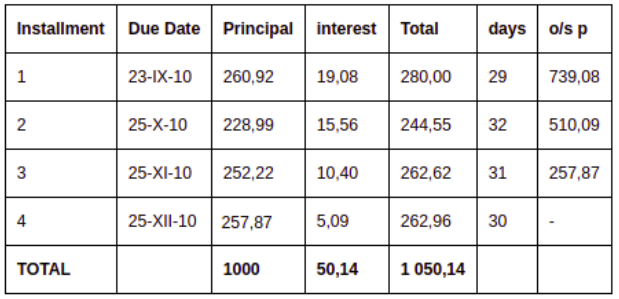

# Microfinance #

**If code is showing an file location error then put the contents of
hpp file into cpp file**

## What is Microfinance ? ##

Microfinance, also called Microcredit​, is a type of banking service that is provided to unemployed or low-income individuals or groups who otherwise would have no other access to financial services ie unbanked or underbanked. While institutions participating in the area of microfinance most often provide lending, many banks offer additional services, such as checking and savings accounts, and micro-insurance products; and some even provide financial and business education. Ultimately, the goal of microfinance is to give impoverished people an opportunity to become self-sufficient.

## Traditional Microfinance - ##

**Hierarchy**

 **Working**

* A village is evaluated to see if microfinance is needed.
* If village is found suitable, an orientation is held to explain the functioning of the MFI.
* Those interested must make groups (of about 5) where all members are guarantors for each other i.e. they’re all responsible for paying back the collective loan and in case one fails, peer pressure is put on him to submit timely payment.
* A village center is chosen for weekly collection of payments which is overseen by the field officer.
* Loans are provided by the Branch officer.

## Modern-day Microfinance - ##

 
## Problem associated with Microfinance Institutions - ##

* High rates of interest (25-40%) as compared to mainstream banks (8-12%) because of high risk involved also money transaction are quite slow and unsafe. Due to this, a situation of over-indebtedness arises and may result in higher suicide rates of borrowers.

* Property risk - Keeping all the assets in the form of cash is sometimes risky because of the because of the living environment 
Lack of risk management framework and multiple borrowings by most clients can lead to over-indebtedness and hence result in a microfinance crisis as it did in India 2008. To prevent this, MFIs usually increase their cost of monitoring.

* In such a setting, the people who put money into microfinance are completely invisible to the people who get microfinance, and vice versa. Hence, there is no provision for accountability. 

* Most of the MFIs are NGOs and get funded for their lending activities by commercial banks which are private and charge a high rate of interest for short periods of time. Over 80% of the MFIs funds come from these banks which leads to an overdependence to them.

* Presently the Reserve Bank of India (RBI) is the regulatory body for the microfinance industry in India. However it has traditionally catered to commercial and traditional banks rather than MFIs’. Not only has it led to constant structural and operational changes but also created ambiguity in norms of conduct. Therefore there is a need for a separate regulatory authority for this industry. 

* Lack of awareness of financial services provided by the Indian microfinance industry is a challenge for both customer and MFIs’. This factor not only causes hindrance for villagers to join hands with MFIs’ to meet their financial needs but also makes them financially excluded. MFIs’ are faced with the task of educating the people and establish trust before selling their product. Micro finance institutions struggle to make their business more financially viable due to this lack of awareness.

## Why Blockchain ? ##

* Offering a new and innovative way of verifying a borrower’s identity
* Creating shared and trusted credit histories ie precise analysis of capital flow of an ecosystem and will allow investors to invest effectively 
* Enabling the sharing and maintenance of sensitive data in more secure ways
* Allowing for cheaper and quicker flows of capital to and from borrowers and hence less risk and lower the interest rate

## Proposed Solution ##

## Participants ## 

* Members of group
* Borrower (group leader)
* Underwriter - Their existence solves another key problem that how can lenders evaluate the credit risk ?
* Relayer - Their existence solves a key problem: if a borrower needs to find a lender to fill their Debt Order, how do they find a prospective lender ?
* Lender
 
## Interest Calculations for Loan Accounts ##

**Declining balance calculation with interest recalculation**

Declining Balance - Interest Recalculation gives user a new possibility in configuring and managing cash flow on loan accounts. The main role of Interest Recalculation is to control early and late payments of each installment. When loan repayment is on time, then Interest Recalculation works in the same way as normal Declining Balance interest rate type.  Interest Recalculation can be mostly useful in cases such as: early payment with less than installment amount, due date payment with excess amount or late payment with equal installment amount.

In case when client pays late, an excess interest is charged from him on the principal he is late on, and for the number of days he is late in making the payment. This excess interest gets added to the next installment and will be shown along with the installment’s interest.
In case the client pays early, only the interest due till payment date is recovered from the payment applied. The remaining amount is allocated towards the principal payment and is reflected against the next installment’s principal.

Interest due till date is recovered first because the installment date for the installment in case of early payment is yet to occur. The installment will not be marked as completely paid in case of early payment. For the date of early payment to the installment date, interest will be calculated on the overall unpaid principal for those number of days.  

In each case it is necessary to count daily rate of interest:
id = (r/100)(1/365)
where 
id - rate of interest per day
r - rate of interest per year  

**Example**  
Payment is early and more than required.

Interest = (o/sp)*days*id  
where: 
o/sp - amount left to repay 
days - number of days since last repayment 
id - interest rate per day
